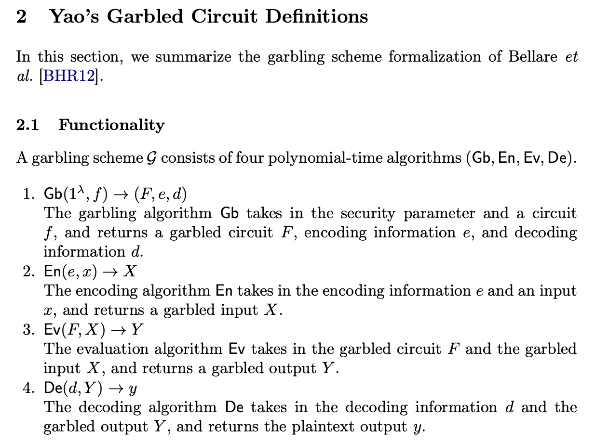
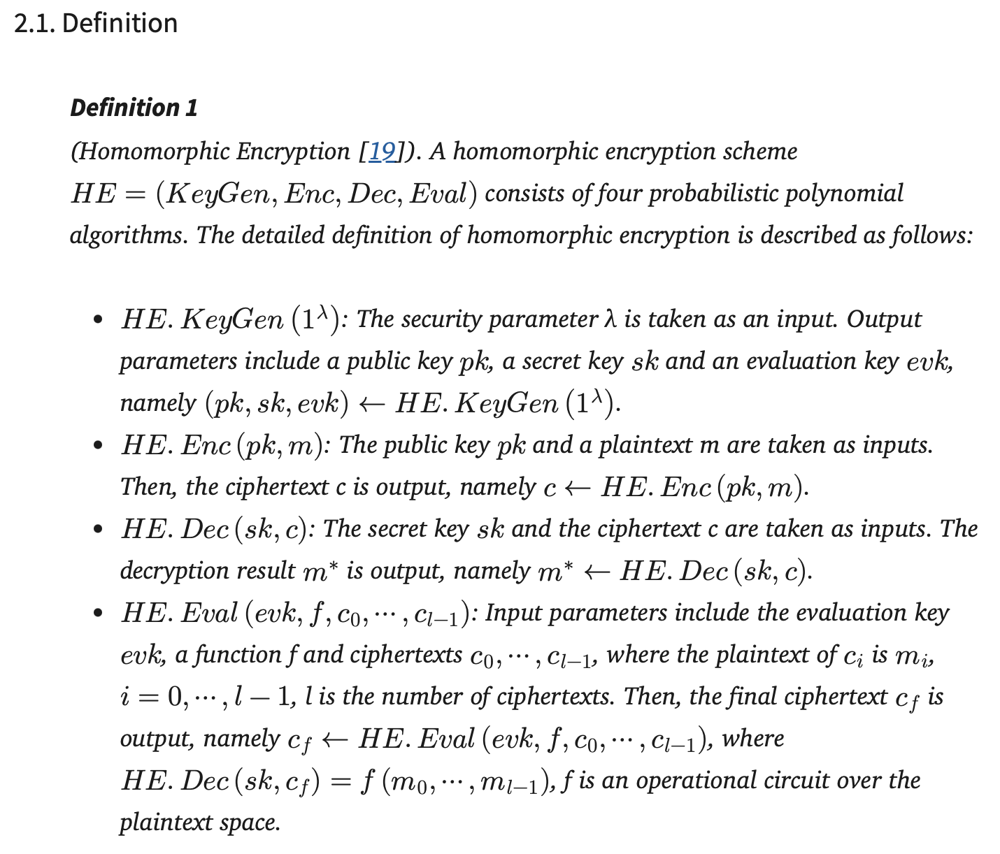

# 测量方案：形式化符号 -> 代码对象 -> 测量值

## 一、GC（乱码电路）

from: https://web.mit.edu/sonka89/www/papers/2017ygc.pdf

下面表中都按照机器之间的通讯顺序排列，重在关注client的通讯量。

| # | 谁发给谁 | 数学符号 | 代码里叫什么 | 测什么 | 实测大小 |
|---|---|---|---|---|---|
| ① | client → server1 | $x_1$ | `x1`（gc_neuron.py line30 generate, line 39 send） | 输入的share | 4 B |
| ② | server1 → client | $F$ | `F`，from `garble(circ)`（line44） | 乱码表 | 19,312 B |
| ③ | server1 → client | $e$ | `e`，from `garble(circ)`（line44） | 编码信息 | 612 B |
| ④ | server1 → client | $d$ | `d`，from `garble(circ)`（line44） | 解码信息 | 2 B |
| ⑤ | client → server2 | $F$ | same `F`，resend | 转发 | 19,312 B |
| ⑥ | client → server2 | $X$ | `X`，from `encode(...)`（line51） | 活跃标签lable | 306 B |
| ⑦ | server2 → client | $Y$ | `Y`，from `evaluate(...)`（line57） | 输出标签 | 153 B |

**client 发出 = ① + ⑤ + ⑥ = 19,622 B**，大头是 ⑤ —— 转发的 $F$。

**关于 `circ`**：`circ` 是电路 $g_{x_1}$，即计算 $g_{x_1}(x_2) = f(x_1 \oplus x_2)$ 的布尔电路，其中 $x_1$ 被当作常数硬编码、$x_2$ 是自由输入。它由第43行的 `build_shared_weighted_sum(n, in_bits, w, b, x1_bits)` 生成，最后一个参数 `x1_bits` 就是被硬编码进去的 $x_1$。

### 区分 `circ` 和 `F`

| 对象 | 是什么 | 谁持有 | 是否传输 |
|---|---|---|---|
| `circ` = $g_{x_1}$ | **明文**布尔电路（未混淆） | server1 本地构造 | **否，从不传输** |
| `F` | `circ` 混淆后的**乱码电路** | server1 生成后发出 | **是，传两次** |

`circ` 是 `garble()` 的**输入**，`F` 是它的**输出**；两者关系为

$$|F| = 4\ \text{行} \times (\lambda+1)\ \text{字节} \times |{\rm circ}|\ \text{的门数}$$

即 **`circ` 决定了 $F$ 有多大，但 `circ` 本身不会上online**。这也是为什么表中没有 `circ` 。
（另注：`circ` 里已经硬编码了 $x_1$，因此也不应发给 server2 —— 发了等于泄露 server1 的份额。）

---

## 二、FHE（Paillier 实例）

from: https://doi.org/10.3390/s20154253

| # | 谁发给谁 | 数学符号 | 代码里叫什么 | 测什么 | 实测大小 |
|---|---|---|---|---|---|
| ① | client → server | $pk$ | `pub`（fhe_paillier.py line24 `keygen` gererate，line27 send） | 公钥 | 256 B |
| ② | client → server | $c$ | `cts`，from `encrypt()`（line31） | 输入密文 | 2,048 B |
| ③ | server → client | $c^f$ | `acc`（line35–40 同态运算结果） | 输出密文 | 512 B |

**client 发出 = ① + ② = 2,304 B**

**说明**：Paillier 的 $KeyGen$ 只输出 $(pk, sk)$，**没有 $evk$**。换成 CKKS 时，消息 ① 变成 $evk$；在我们的瘦身配置下（不用旋转，因此不生成 Galois 密钥）实测 $|evk| = 13.7$ MB，其中重线性化密钥约 12 MB 是躲不掉的 —— 因为平方激活是密文×密文乘法。

---

## 三、SPDZ

### 形式化定义

SPDZ 在有限域 $\mathbb{F}_p$ 上计算算术电路 $C$。和 GC 的区别：GC 是布尔电路 + 异或分享，SPDZ 是算术电路 + 加法分享。

定义参考MPC教材 §6.6.2 (Fig. 6.3)，具体overview可看2.4节 https://eprint.iacr.org/2017/1230.pdf。

**秘密分享**

有一个全局 MAC 密钥 $\Delta=\Delta_1+\Delta_2$，两台 server 各持一份，谁都不知道完整的 $\Delta$。

值 $x$ 的分享记作 $[\![x]\!]$，$server_i$ 持有 $(x_i,t_i)$：

$$x_1+x_2=x,\qquad t_1+t_2=\Delta x$$

$t_i$ 是 MAC 份额，用来检查有没有被篡改。

**加法、乘公开常数**

两台 server 各自在本地份额上算，不通信（offline）。

**乘法（两个秘密值相乘）**

用预处理阶段生成的 Beaver 三元组 $([\![r]\!],[\![s]\!],[\![rs]\!])$，先打开两个值：

$$\alpha=\mathrm{Open}([\![u]\!]-[\![r]\!]),\qquad \beta=\mathrm{Open}([\![v]\!]-[\![s]\!])$$

再本地组合得到 $[\![uv]\!]=[\![rs]\!]+\alpha[\![s]\!]+\beta[\![r]\!]+\alpha\beta$。

所以每个乘法要在两台 server 之间打开 2 个数。

**打开**

$\mathrm{Open}([\![x]\!])$：两台 server 交换份额得 $x=x_1+x_2$，再用 $t_i$ 校验 MAC，不对就 abort。

**协议流程**

client 把输入 $x$ 拆成 $x_1,x_2$ 分别发给两台 server；两台 server 在份额上算完电路 $C$（client 不参与）；把输出份额 $y_1,y_2$ 发回；client 算 $y=y_1+y_2$。

client 只发输入份额、只收输出份额，通信量与电路规模 $|C|$ 无关。

### SPDZ（计划测量）

| # | 谁发给谁 | 数学符号 | 代码里将叫什么 | 测什么 | 预计大小 |
|---|---|---|---|---|---|
| ① | client → server1 | $x_1$ | 输入| 字节数 | 约 16 B / 每输入 |
| ② | client → server2 | $x_2$ | 输入| 字节数 | 约 16 B / 每输入 |
| ③ | **server1 ↔ server2** | $\alpha,\beta$（Beaver 打开值） | 框架内部 | **不计入 client 通信** | 正比于 \|C\| |
| ④ | server1 → client | $y_1$ | 输出 | 字节数 | 约 16 B / 每输出 |
| ⑤ | server2 → client | $y_2$ | 输出| 字节数 | 约 16 B / 每输出 |

**client 发出 = ① + ② ≈ 128 B**（4 个输入 × 2 份 × 16 B），**与电路规模 |C| 无关**。

**说明**：定义里的 $\Delta,t_i$ 是内部状态，Beaver 三元组 $([\![r]\!],[\![s]\!],[\![rs]\!])$ 属于 offline 预处理，都不计入 client 通信。

本例中权重 $w$ 是公开的，所以乘法是「乘公开常数」，本地即可计算、不产生通信，也不消耗 Beaver 三元组。第 ③ 行只在两个**秘密值**相乘时才出现（如非线性激活，或权重也保密的场景）。表中数值是按 128-bit 域的解析估计，实测值待 MP-SPDZ 跑通后替换。

---

## 四、代入具体数字，以单个线形神经元 z=wx+b 为例

取 $x = 5$（client 私有），$w = 3$、$b = 2$（公开），正确答案 $z = 3\times5+2 = \mathbf{17}$。

**注意两种分享方式不同**：GC 在布尔电路上工作，用**异或**分享；SPDZ 在域上做算术电路，用**加法**分享。因此两者的份额取值必须分别设定。

### GC（异或分享：$x = x_1 \oplus x_2$）

取 $x_1 = 6$，则 $x_2 = 5 \oplus 6 = 3$（验证：$0101 \oplus 0110 = 0011 = 3$，且 $6 \oplus 3 = 5$ ✓）

| 步骤 | 动作 |
|---|---|
| ① | client → server1 发 $x_1 = 6$ |
| （本地） | server1 构造 `circ` $= g_6(x_2) = 3\cdot(6 \oplus x_2) + 2$，**不传输** |
| （本地） | server1 混淆：$\mathsf{Gb}(1^\lambda, {\rm circ}) \to (F,e,d)$ |
| ②③④ | server1 → client 发 $(F, e, d)$ |
| （本地） | client 用 $e$ 选出 $x_2 = 3$（比特 0011）对应的标签 $X$ |
| ⑤⑥ | client → server2 发 $(F, X)$ |
| （本地） | server2 求值 $\mathsf{Ev}(F,X) \to Y$ |
| ⑦ | server2 → client 发 $Y$ |
| （本地） | client 解码 $\mathsf{De}(d,Y) = 3\cdot(6\oplus3)+2 = 3\cdot5+2 = \mathbf{17}$ ✓ |

### FHE (Paillier)

| 步骤 | 动作 |
|---|---|
| ① | client → server 发 $pk$ |
| （本地） | client 加密：$ct = \mathsf{Enc}(pk, 5)$ |
| ② | client → server 发 $ct$ |
| （本地） | server 同态计算：$ct^* = ct^{3}\cdot(1+n\cdot2) = \mathsf{Enc}(3\cdot5+2)$ |
| ③ | server → client 发 $ct^*$ |
| （本地） | client 解密：$\mathsf{Dec}(sk, ct^*) = \mathbf{17}$ ✓ |

### SPDZ（加法分享：$x = x_1 + x_2$）

取 $x_1 = 2$，$x_2 = 3$（验证：$2+3 = 5$ ✓）

| 步骤 | 动作 |
|---|---|
| ① | client → server1 发 $x_1 = 2$ |
| ② | client → server2 发 $x_2 = 3$ |
| （本地） | server1 算 $3 \times 2 = 6$，再加偏置 $b=2$ 得 $y_1 = 8$ —— **零通信** |
| （本地） | server2 算 $3 \times 3 = 9$，得 $y_2 = 9$ —— **零通信** |
| ④ | server1 → client 发 $y_1 = 8$ |
| ⑤ | server2 → client 发 $y_2 = 9$ |
| （本地） | client 重构：$y_1 + y_2 = 8 + 9 = \mathbf{17}$ ✓ |

**此例子说明了 SPDZ 省在哪**：因为 $w$ 公开，两台 server 各自本地做数乘和加常数即可，**中间完全没有通信**（也没用到 Beaver 三元组）；client 只发了 2 个数、收了 2 个数。相比之下，GC 的 client 必须把整个乱码电路 $F$ 转发一次。

---

## 五、对比：client 发出多少

| 组件 | client 发出 | 随电路规模增长吗 |
|---|---|---|
| GC | 19,622 B | **是**（必须转发 $F$） |
| FHE (Paillier) | 2,304 B | 否，但 CKKS 下有大的固定项 $\|evk\|$ |
| **SPDZ** | **约 128 B** | **否，完全无关** |

SPDZ 的 client 通信约为 GC 的 **1/150**、Paillier 的 **1/18**。

原因：**SPDZ 把所有与 |C| 相关的通信都限制在两台 server 之间**；而 GC 的 client 必须转发乱码电路，FHE 的 client 必须传输大密钥并自己执行加解密。
